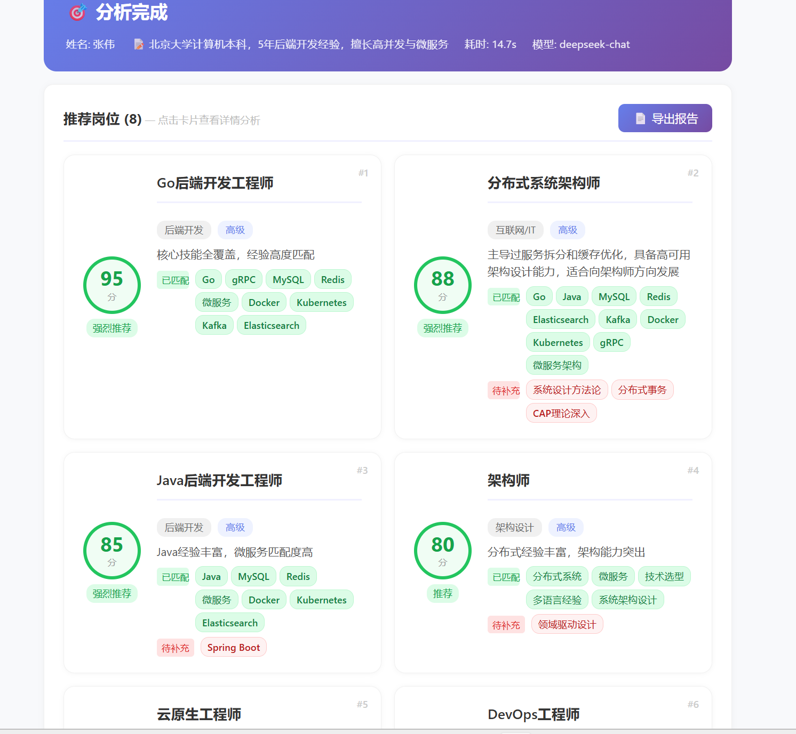
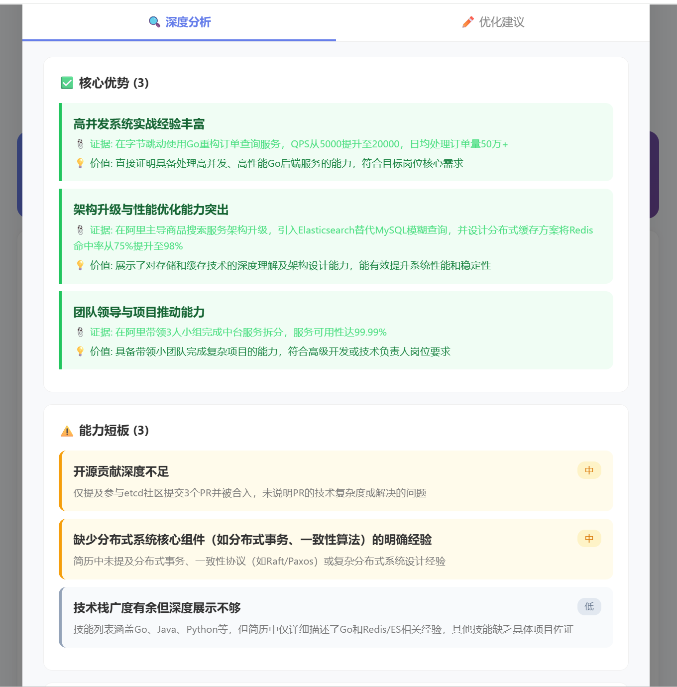

# 简历智能分析工具

> 作者：张尧 | 全栈开发 | FastAPI + React + DeepSeek API

[](https://python.org)
[](https://fastapi.tiangolo.com)
[](https://react.dev)
[](https://www.typescriptlang.org)
[](LICENSE)

AI 驱动的简历分析与岗位智能匹配工具。上传简历 → AI 解析结构化信息 → 64 岗位知识库匹配 + AI 自主推荐跨行业方向 → 深度分析（优势/短板/关键词/STAR 评估）→ 逐条优化建议，全链路自动化。

---

## 本地运行

需要 Python 3.14+、Node.js 22+ 和 DeepSeek API Key。

```bash
# 1. 后端
cd backend
python -m venv venv
venv\Scripts\activate
pip install -r requirements.txt
cp .env.example .env  # 编辑 .env 填入 DEEPSEEK_API_KEY
uvicorn app.main:app --port 8010 --reload

# 2. 前端（新开终端）
cd frontend
npm install
npm run dev
```

浏览器打开 `http://localhost:5173`，API 文档 `http://localhost:8010/docs`

> 暂未提供在线 Demo（后端依赖 API Key 无法公开部署）。如有需要可联系我录制演示视频。

---

## 功能预览


*岗位 Top 8 推荐 + 深度分析：核心优势、能力短板、关键词匹配、STAR 评估*


*简历逐条改写建议（原文对比）、补充项、结构优化、面试问题预测、关键词优化*

---

## 技术栈

| 层级 | 技术 |
|------|------|
| 前端 | React 19 + TypeScript 6 + Vite 8 |
| 后端 | Python 3.14 + FastAPI + SQLAlchemy |
| AI 引擎 | DeepSeek API（OpenAI SDK） |
| 数据库 | SQLite |
| 文件解析 | pdfplumber（PDF）+ python-docx（Word） |

前后端分离架构，Pydantic ↔ TypeScript 类型严格对齐，编译期发现字段不匹配。

---

## 核心功能

- **简历解析** — 粘贴文本 / 拖拽 PDF/Word，AI 提取姓名/技能/经历/项目等结构化信息
- **岗位匹配** — 64 岗位知识库精准匹配 + AI 自主推荐未知方向，0-100 打分，覆盖 10+ 行业
- **深度分析** — 核心优势 + 能力短板（分高/中/低严重级别）+ 技术关键词逐项匹配 + STAR 法则评估
- **优化建议** — 原文 vs 优化逐条对比、补充项示例、结构建议、面试问题预测、关键词 ATS 优化
- **历史记录** — 自动保存分析记录，前端详情缓存实现二次秒开
- **导出报告** — 浏览器打印另存为 PDF，候选人姓名动态命名

---

## 架构设计

```
Browser :5173
  │ HTTP
  ▼
FastAPI :8010
  ├── 路由层  POST /submit  POST /analyze-detail  GET /history
  ├── analyzer.py    → AI 简历解析
  ├── matcher.py     → 两步岗位匹配（知识库 64 岗位 + AI 自主推荐）
  └── detail_service.py → 深度分析 + 优化建议（ThreadPoolExecutor 并行调用，耗时 5-8s）
        │
  ┌─────▼─────┐
  │ ai_client.py  │ ← 公共 AI 调用模块：30s 超时 · 1 次重试 · 统一日志
  └─────┬─────┘
        │
  ┌─────▼─────┐   ┌──────────┐
  │ DeepSeek  │   │  SQLite  │
  │    API    │   │  (本地)   │
  └───────────┘   └──────────┘
```

---

## 项目亮点

### 公共 AI 调用模块
三个核心服务（解析/匹配/详情）复用 `ai_client.py`，统一管理 30s 超时、自动重试、结构化日志，避免重复代码。

### 三层 JSON 容错
AI 输出不稳定时自建解析器按优先级兜底：直接 JSON 解析 → 正则提取 Markdown 代码块 → 首尾大括号截取，大幅降低解析失败率。

### 并行调用优化
深度分析和优化建议通过 `ThreadPoolExecutor` 同时发起，响应时间从 10-15s 降至 5-8s。

### 两步智能匹配
- 知识库匹配：64 岗位覆盖 10+ 行业，含行业隔离规则
- AI 自主推荐：知识库未覆盖方向由 AI 独立推荐，标注「AI推荐」标签

### 前后端类型对齐
后端 Pydantic 模型 ↔ 前端 TypeScript 类型一一对应，编译期发现字段不匹配。

---

## 项目结构

```
resume-analyzer/
├── backend/
│   ├── app/
│   │   ├── main.py                  # FastAPI 入口，CORS
│   │   ├── core/config.py           # 环境变量管理
│   │   ├── models/resume.py         # Pydantic 模型
│   │   ├── api/routes/resume.py     # API 路由
│   │   ├── services/
│   │   │   ├── ai_client.py         # 公共 AI 调用
│   │   │   ├── analyzer.py          # 简历解析
│   │   │   ├── matcher.py           # 岗位匹配
│   │   │   ├── detail_service.py    # 深度分析+优化（并行）
│   │   │   ├── file_parser.py       # PDF/Word 解析
│   │   │   └── history.py           # 历史记录
│   │   ├── db/database.py           # SQLAlchemy
│   │   └── data/jobs.json           # 64 岗位知识库
│   ├── .env.example
│   └── requirements.txt
├── frontend/
│   └── src/
│       ├── pages/HomePage.tsx
│       ├── components/
│       │   ├── ResumeInput.tsx       # 文本/文件双模式
│       │   ├── FileUpload.tsx        # 拖拽上传
│       │   ├── JobCard.tsx           # 岗位推荐卡片
│       │   ├── JobDetail.tsx         # 岗位详情 Modal
│       │   ├── ResultCard.tsx        # 结果展示
│       │   └── HistoryList.tsx       # 历史记录
│       ├── services/api.ts
│       └── types/resume.ts
└── .gitignore
```

---

## 环境变量

| 变量 | 说明 | 默认值 |
|------|------|--------|
| `DEEPSEEK_API_KEY` | DeepSeek API 密钥 | 必填 |
| `DEEPSEEK_BASE_URL` | API 地址 | `https://api.deepseek.com` |
| `DEEPSEEK_MODEL` | 模型名称 | `deepseek-chat` |
| `APP_PORT` | 服务端口 | `8010` |
| `DATABASE_URL` | 数据库路径 | `sqlite:///./resume_analyzer.db` |
